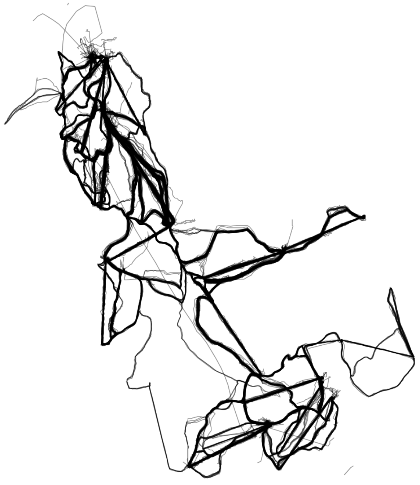

# Ski Data Risoul
Ski (and snowboard) data March 2019 Risoul &amp; Vars

## Data Gathering

All ski data received was tracked with mobile phones using the app Ski Tracker.
The ski data is of the season March 2019 gathered from the 9th of March until the 16 of March.
During this time not all slopes or ski lifts were open which will clearly show from the data.
For further reference off the ski slopes and lifts, please look at the attached map.

## Post processing
After all data was received, post processing steps were done.
First all data, received in GPX format, was converted to txt files.
Second, when two consecutive points are at exactly the same xy coordinate, only the first point is saved.
Third, when two consecutive points are at more than 200 meters difference and the sampling time was also 15 seconds difference, the file was split up.
Fourth, we removed the all split up files from the same original GPX file, if it contained to many split ups.

## Speed up
For faster computations, I used a smaller subset of both Vars and Risoul separately. 
These are also present in the git.

## Credits
### Trackers
I would like to thank a long list of friendly people who helped me by tracking their skiing with Ski Tracks as well.
Their names are Boris van Vught, Chiel Zelders, Daan Hendriks, Dana Bosman, Dorrith Verstegen, Janneke Kersten, Jarred Getrouw, Jasper Adegeest, Jeffrey Smit, Jeroen Hilhorst, Jurjen Leer, Lana Krahenbuhl, Loran Corsten, Lukas Martens, Luuk Broekhaus, Matthijs Kamerling, Mayra Goevaerts, Merel Meima, Michelle Mak, Nick Krijgsman, Niels Salters, Noelle Dirks, Rein Lucassen, Rens van Hulst, Rik Leliveld, Sebastiaan van den Bijllaardt, Sil Duckers, Stefan Cavens, Stefan Delfgou, Steven Van Der Waal, Tamar van Asch, Tim Daemen, Veerle Heijnen and Wouter Smit.
Thank you all for your cooperation!

### Ski tracks
Thanks to the creators of the app Ski Tracks which allowed us to track our GPS data.

The app is available for IOS for free [here](https://itunes.apple.com/us/app/ski-tracks-lite/id368024976?mt=8) and a paid version [here](https://itunes.apple.com/us/app/ski-tracks/id365724094?mt=8).
For Android it's available [here](https://play.google.com/store/apps/details?id=com.corecoders.skitracks).

### Piste map
The ski map was found at [https://www.skiresort.nl](https://www.skiresort.nl/skigebied/varsrisoul-la-foret-blanche/pistekaart/#&gid=1&pid=1)